# GitBucket Markdown Enhanced Plugin

Powered by [flexmark-java](https://github.com/vsch/flexmark-java)

- [The goal](#the-goal)
- [Extensions used](#extensions-used)
  - [AbbreviationExtension](#abbreviationextension)
  - [AnchorLinkExtension](#anchorlinkextension)
  - [EmojiExtension](#emojiextension)
  - [FootnoteExtension](#footnoteextension)
  - [GfmIssuesExtension](#gfmissuesextension)
  - [GitLabExtension](#gitlabextension)
  - [StrikethroughSubscriptExtension](#strikethroughsubscriptextension)
  - [SuperscriptExtension](#superscriptextension)
  - [TablesExtension](#tablesextension)
  - [TaskListExtension](#tasklistextension)
  - [TocExtension](#tocextension)
  - [WikiLinkExtension](#wikilinkextension)
- [KaTeX support(same syntax of Markdown Preview Enhanced)](#katex-supportsame-syntax-of-markdown-preview-enhanced)
  - [inline](#inline)
  - [block](#block)
- [Diagrams](#diagrams)
  - [PlantUML support (MIT License version)](#plantuml-support-mit-license-version)
  - [wavedrom support](#wavedrom-support)
  - [vega and vega-lite support](#vega-and-vega-lite-support)
- [Install](#install)
- [Build from source](#build-from-source)
- [License](#license)

## The goal

[Visual Studio Code](https://code.visualstudio.com/) extension [Markdown Preview Enhanced](https://shd101wyy.github.io/markdown-preview-enhanced/#/)

- [x] [Basic Syntax](https://shd101wyy.github.io/markdown-preview-enhanced/#/markdown-basics?id=syntax-guide)
- [Extended syntax](https://shd101wyy.github.io/markdown-preview-enhanced/#/markdown-basics?id=extended-syntax)
  - [ ] [Table](https://shd101wyy.github.io/markdown-preview-enhanced/#/markdown-basics?id=table)
  - [x] [Emoji & Font-Awesome](https://shd101wyy.github.io/markdown-preview-enhanced/#/markdown-basics?id=emoji-amp-font-awesome)(Emoji only)
  - [x] [Superscript](https://shd101wyy.github.io/markdown-preview-enhanced/#/markdown-basics?id=superscript)(0.1.1)
  - [x] [Subscript](https://shd101wyy.github.io/markdown-preview-enhanced/#/markdown-basics?id=subscript)(0.1.1)
  - [x] [Footnotes](https://shd101wyy.github.io/markdown-preview-enhanced/#/markdown-basics?id=footnotes)
  - [x] [Abbreviation](https://shd101wyy.github.io/markdown-preview-enhanced/#/markdown-basics?id=abbreviation)(0.2.0)
  - [x] [Mark](https://shd101wyy.github.io/markdown-preview-enhanced/#/markdown-basics?id=mark)(0.4.0)
  - [x] [CriticMarkup](https://shd101wyy.github.io/markdown-preview-enhanced/#/markdown-basics?id=criticmarkup)(0.7.0)
  - [x] [Admonition](https://shd101wyy.github.io/markdown-preview-enhanced/#/markdown-basics?id=admonition)(different grammar. since 0.2.0)
- [x] [Math Typesetting](https://shd101wyy.github.io/markdown-preview-enhanced/#/math)(Katex only)
- [Diagrams](https://shd101wyy.github.io/markdown-preview-enhanced/#/diagrams)
  - [x] [Mermaid](https://shd101wyy.github.io/markdown-preview-enhanced/#/diagrams?id=mermaid)
  - [x] [PlantUML](https://shd101wyy.github.io/markdown-preview-enhanced/#/diagrams?id=plantuml)(0.3.0)
  - [x] [WaveDrom](https://shd101wyy.github.io/markdown-preview-enhanced/#/diagrams?id=wavedrom)(0.5.0)
  - [x] [GraphViz](https://shd101wyy.github.io/markdown-preview-enhanced/#/diagrams?id=graphviz)(0.5.1)
  - [x] [Vega and Vega-lite](https://shd101wyy.github.io/markdown-preview-enhanced/#/diagrams?id=vega-and-vega-lite)(0.6.0)(yaml is not supported)
  - [ ] [Kroki](https://shd101wyy.github.io/markdown-preview-enhanced/#/diagrams?id=kroki)
- [x] [Table of Contents](https://shd101wyy.github.io/markdown-preview-enhanced/#/toc)
- [ ] [File Imports](https://shd101wyy.github.io/markdown-preview-enhanced/#/file-imports)
- [ ] [Code Chunk](https://shd101wyy.github.io/markdown-preview-enhanced/#/code-chunk)
- [ ] [Presentation](https://shd101wyy.github.io/markdown-preview-enhanced/#/presentation)
- [ ] [Pandoc](https://shd101wyy.github.io/markdown-preview-enhanced/#/pandoc)

## Extensions used

- [AbbreviationExtension](https://github.com/vsch/flexmark-java/wiki/Extensions#abbreviation)
- [AdmonitionExtension](https://github.com/vsch/flexmark-java/wiki/Extensions#admonition)
- [AnchorLinkExtension](https://github.com/vsch/flexmark-java/wiki/Extensions#anchorlink)
- [EmojiExtension](https://github.com/vsch/flexmark-java/wiki/Extensions#emoji) (Under investigation)
- [FootnoteExtension](https://github.com/vsch/flexmark-java/wiki/Extensions#footnotes)
- [GfmIssuesExtension](https://github.com/vsch/flexmark-java/wiki/Extensions#gfm-issues)
- [GitLabExtension](https://github.com/vsch/flexmark-java/wiki/Extensions#gitlab-flavoured-markdown)
- [StrikethroughSubscriptExtension](https://github.com/vsch/flexmark-java/wiki/Extensions#gfm-strikethroughsubscript)
- [SuperscriptExtension](https://github.com/vsch/flexmark-java/wiki/Extensions#superscript)
- [TablesExtension](https://github.com/vsch/flexmark-java/wiki/Extensions#tables)
- [TaskListExtension](https://github.com/vsch/flexmark-java/wiki/Extensions#gfm-tasklist)
- [TocExtension](https://github.com/vsch/flexmark-java/wiki/Extensions#table-of-contents)
- [WikiLinkExtension](https://github.com/vsch/flexmark-java/wiki/Extensions#wikilinks)

### AbbreviationExtension

Allows to create abbreviations which will be replaced in plain text into <abbr></abbr> tags or optionally into <a></a> with titles for the abbreviation expansion.

```markdown
*[HTML]: Hyper Text Markup Language
*[W3C]: World Wide Web Consortium
The HTML specification
is maintained by the W3C.
```

to

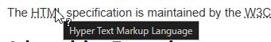

### AdmonitionExtension

To create block-styled side content. 

```markdown
!!! qualifier "Optional Title"
    block content 
```

to

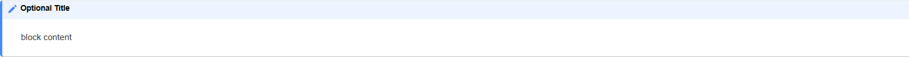

See also [Admonition Extension · vsch/flexmark-java Wiki](https://github.com/vsch/flexmark-java/wiki/Admonition-Extension)

### AnchorLinkExtension

Automatically adds anchor links to heading, using GitHub id generation algorithm.

### EmojiExtension

`:grinning:` -> :grinning:

### FootnoteExtension

Creates footnote references in the document.

```markdown
FootnoteExtension[^1] creates footnote references in the document.

[^1]: https://github.com/vsch/flexmark-java/wiki/Extensions#footnotes
```

FootnoteExtension[^1] creates footnote references in the document.

[^1]: https://github.com/vsch/flexmark-java/wiki/Extensions#footnotes

### GfmIssuesExtension

Enables issue reference parsing in the form of `#123`.

### GitLabExtension

Parses and renders [GitLab Flavoured Markdown](https://gitlab.com/gitlab-org/gitlab-ce/blob/master/doc/user/markdown.md).

#### Katex support

<pre>
```math
a^2+b^2=c^2
```
</pre>

to

```math
a^2+b^2=c^2
```

#### mermaid support

```markdown
graph TD;
  A-->B;
  A-->C;
  B-->D;
  C-->D;
```

to


### StrikethroughSubscriptExtension

`~~Strikethrough~~` -> ~~Strikethrough~~

`H~2~O` -> 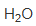

### SuperscriptExtension

`x^2^` -> 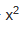

### TablesExtension

See [Tables Extension · vsch/flexmark-java Wiki](https://github.com/vsch/flexmark-java/wiki/Tables-Extension)

### TaskListExtension

```markdown
- [x] Katex support
- [x] mermaid support
- [ ] PlantUML support
```

to

- [x] Katex support
- [x] mermaid support
- [ ] PlantUML support

### TocExtension

`[TOC]` create table of contents.

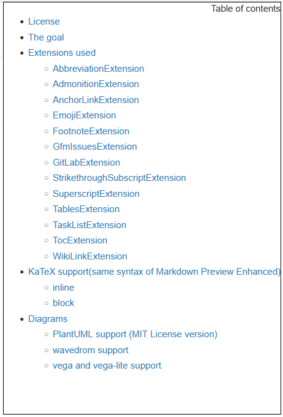

You click `Table of contents` to closel table of contents.

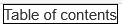

### WikiLinkExtension

Enables wiki links `[[page reference]]`.

## KaTeX support(same syntax of Markdown Preview Enhanced)

### inline

<pre>syntax: $a^2+b^2=c^2$</pre>

to

syntax: $a^2+b^2=c^2$

<pre>\(a^2+b^2=c^2\)</pre>

to

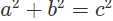

### block

```
\[a^2+b^2=c^2\]
```

to


## Diagrams

mermaid can be rendered using the flexmark-java GitLab extension. explained above. 

### PlantUML support (MIT License version)

[PlantUML Licensing Options](https://plantuml.com/en/download#mit)

exclude follow diagrams.

- Ditaa
- Jcckit
- Sudoku
- ELK

<pre>
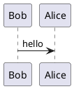
</pre>

to

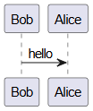

### wavedrom support

<pre>
```wavedrom
{ signal : [
  { name: "clk",  wave: "p......" },
  { name: "bus",  wave: "x.34.5x",   data: "head body tail" },
  { name: "wire", wave: "0.1..0." },
]}
```
</pre>

to

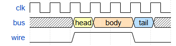

### vega and vega-lite support

<pre>
```vega
{
  "$schema": "https://vega.github.io/schema/vega/v6.json",
  "description": "A basic bar chart example, with value labels shown upon pointer hover.",
  "width": 400,
  "height": 200,
  "padding": 5,

  "data": [
    {
      "name": "table",
      "values": [
        {"category": "A", "amount": 28},
        {"category": "B", "amount": 55},
        {"category": "C", "amount": 43},
        {"category": "D", "amount": 91},
        {"category": "E", "amount": 81},
        {"category": "F", "amount": 53},
        {"category": "G", "amount": 19},
        {"category": "H", "amount": 87}
      ]
    }
  ],

  "signals": [
    {
      "name": "tooltip",
      "value": {},
      "on": [
        {"events": "rect:pointerover", "update": "datum"},
        {"events": "rect:pointerout",  "update": "{}"}
      ]
    }
  ],

  "scales": [
    {
      "name": "xscale",
      "type": "band",
      "domain": {"data": "table", "field": "category"},
      "range": "width",
      "padding": 0.05,
      "round": true
    },
    {
      "name": "yscale",
      "domain": {"data": "table", "field": "amount"},
      "nice": true,
      "range": "height"
    }
  ],

  "axes": [
    { "orient": "bottom", "scale": "xscale" },
    { "orient": "left", "scale": "yscale" }
  ],

  "marks": [
    {
      "type": "rect",
      "from": {"data":"table"},
      "encode": {
        "enter": {
          "x": {"scale": "xscale", "field": "category"},
          "width": {"scale": "xscale", "band": 1},
          "y": {"scale": "yscale", "field": "amount"},
          "y2": {"scale": "yscale", "value": 0}
        },
        "update": {
          "fill": {"value": "steelblue"}
        },
        "hover": {
          "fill": {"value": "red"}
        }
      }
    },
    {
      "type": "text",
      "encode": {
        "enter": {
          "align": {"value": "center"},
          "baseline": {"value": "bottom"},
          "fill": {"value": "#333"}
        },
        "update": {
          "x": {"scale": "xscale", "signal": "tooltip.category", "band": 0.5},
          "y": {"scale": "yscale", "signal": "tooltip.amount", "offset": -2},
          "text": {"signal": "tooltip.amount"},
          "fillOpacity": [
            {"test": "datum === tooltip", "value": 0},
            {"value": 1}
          ]
        }
      }
    }
  ]
}
```
</pre>

to

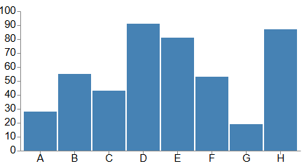

<pre>
```vega-lite
{
  "$schema": "https://vega.github.io/schema/vega-lite/v6.json",
  "description": "A simple bar chart with embedded data.",
  "data": {
    "values": [
      {
        "a": "A",
        "b": 28
      },
      {
        "a": "B",
        "b": 55
      },
      {
        "a": "C",
        "b": 43
      },
      {
        "a": "D",
        "b": 91
      },
      {
        "a": "E",
        "b": 81
      },
      {
        "a": "F",
        "b": 53
      },
      {
        "a": "G",
        "b": 19
      },
      {
        "a": "H",
        "b": 87
      },
      {
        "a": "I",
        "b": 52
      }
    ]
  },
  "mark": "bar",
  "encoding": {
    "x": {
      "field": "a",
      "type": "ordinal"
    },
    "y": {
      "field": "b",
      "type": "quantitative"
    }
  }
}
```
</pre>

to

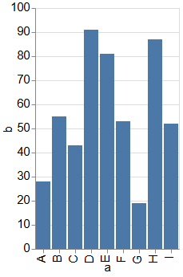

## Install

- download  gitbucket-markdown-enhanced-{plugin-version}.jar from [Releases](https://github.com/yasumichi/gitbucket-markdown-enhanced/releases)
- Place the downloaded file in ~/.gitbucket/plugins.

## Build from source

```
sbt assembly
```

This makes the assembly package target/scala-2.13/gitbucket-markdown-enhanced-{plugin-version}.jar for deployment.

## License

This plugin is licensed under the MIT license.

However, the included libraries are subject to their own licenses.

- [flexmark-java](https://github.com/vsch/flexmark-java) -  [BSD-2-Clause license](https://raw.githubusercontent.com/vsch/flexmark-java/refs/heads/master/LICENSE.txt)
- [KaTeX](https://github.com/KaTeX/KaTeX) - [MIT license](https://raw.githubusercontent.com/KaTeX/KaTeX/refs/heads/main/LICENSE)
- [mermaid](https://github.com/mermaid-js/mermaid) - [MIT license](https://raw.githubusercontent.com/mermaid-js/mermaid/refs/heads/develop/LICENSE)
- [plantuml-mit](https://github.com/plantuml/plantuml-mit) - [MIT License](https://raw.githubusercontent.com/plantuml/plantuml-mit/refs/heads/master/LICENSE)
- [vega](https://github.com/vega/vega), [vega-lite](https://github.com/vega/vega-lite) and [vega-embed](https://github.com/vega/vega-embed) - [BSD-3-Clause license](https://raw.githubusercontent.com/vega/vega/refs/heads/main/LICENSE)
- [wavedrom](https://github.com/wavedrom/wavedrom) - [MIT license](https://raw.githubusercontent.com/wavedrom/wavedrom/refs/heads/trunk/LICENSE)
